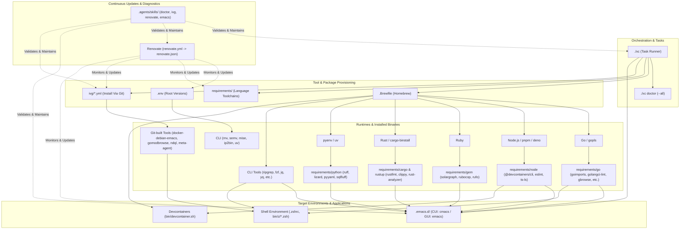

# Dotfiles Repository Guidelines & Agent Instructions

This document provides operational context, coding standards, safety principles, and skill routing instructions for AI assistants operating within this repository.

---

## 1. Repository Architecture & Key Components

* **Task Runner (`xc`)**:
  * [README.md](file:///README.md) defines runnable tasks. Use [`./xc <task>`](file:///xc) as the primary interface for repository workflows (e.g., `./xc doctor`, `./xc renovate.json`, `./xc init`).
* **Dependency Domains**:
  * **System / CLI**: [.Brewfile](file:///.Brewfile) managed by Homebrew.
  * **Root Tooling Versions**: [.env](file:///.env) (`RNV_VERSION`, `SEMV_VERSION`, `MISE_VERSION`, `IP2BIN_VERSION`, `UV_VERSION`, `PY_VERSION`).
  * **Language Runtimes**: [requirements/](file:///requirements) (`cargo`, `gem`, `go`, `node`, `python`, `rustup`) installed via `bin/install-requirements.sh`.
  * **Git-built Binaries (`ivg`)**: [ivg/](file:///ivg) target definitions (`ivg/*.yml`), tracked by [targets/util](file:///targets/util), [targets/other](file:///targets/other), and [targets/additional](file:///targets/additional).
* **Emacs Environment**:
  * Managed under [.emacs.d/](file:///.emacs.d).
  * Dual architecture: CUI (`/usr/local/bin/emacs`, `cmacs`) and GUI (`/Applications/Emacs-GUI.app`, `emacs`/`gmacs`).
  * Package pinning via [straight-default.el](file:///.emacs.d/straight-default.el).
  * Tree-sitter sources pinned in [treesit-language-source-alist.el](file:///.emacs.d/treesit-language-source-alist.el).
* **Automated Dependency Updates (Renovate)**:
  * Master configuration: [renovate.yml](file:///renovate.yml).
  * Compiled JSON: [renovate.json](file:///renovate.json).

### Tool & Component Dependency Graph



---

## 2. Mandatory Coding & Quality Constraints

Every modification must strictly conform to these repository standards:

1. **Line Count Limits (Enforced by `.github/bin/lint.sh`)**:
   * **Bash scripts**: Maximum **200 lines**.
   * **Zsh scripts**: Maximum **100 lines**.
   * Large scripts must be modularized or placed under `.agents/skills/common/`.
2. **Shellcheck Compliance**:
   * All shell scripts (`*.sh`, `*.zsh`) must pass `shellcheck` with zero warnings.
3. **Renovate Configuration Synchronization**:
   * If [renovate.yml](file:///renovate.yml) is modified, always regenerate [renovate.json](file:///renovate.json):
     ```bash
     yq -o json renovate.yml > renovate.json
     # or via task runner:
     ./xc renovate.json
     ```

---

## 3. Dedicated Agent Skills

Specialized workflows are codified as reusable skills under [.agents/skills/](file:///.agents/skills):

| Skill Name | Location | Primary Triggers & Capabilities |
| :--- | :--- | :--- |
| **`dotfiles-doctor`** | [.agents/skills/dotfiles-doctor/](file:///.agents/skills/dotfiles-doctor) | Run general integrity check, detect unreferenced packages in `requirements/`, verify formatters and `brew doctor`.<br>Command: `./xc doctor` or `bash .agents/skills/dotfiles-doctor/scripts/doctor.sh --all` |
| **`ivg-workflow`** | [.agents/skills/ivg-workflow/](file:///.agents/skills/ivg-workflow) | Manage tools built from git repositories, update `ivg/locks/`, synchronize `ivg/renovate.lock`, retry failed builds.<br>Command: `bash .agents/skills/ivg-workflow/scripts/ivg-doctor.sh` |
| **`renovate-ops`** | [.agents/skills/renovate-ops/](file:///.agents/skills/renovate-ops) | Compile and validate `renovate.yml`, dynamically verify `customManagers` regex patterns with target files, run dry-runs.<br>Command: `bash .agents/skills/renovate-ops/scripts/renovate-sync.sh` |
| **`emacs-healthcheck`** | [.agents/skills/emacs-healthcheck/](file:///.agents/skills/emacs-healthcheck) | Check Emacs headless batch startup, detect keymap collisions, verify external formatters, prune caches.<br>Command: `bash .agents/skills/emacs-healthcheck/scripts/emacs-doctor.sh` |

---

## 4. Operational Principles & Safety Guidelines

* **Preserve Intentional Tools**: Never delete packages from `requirements/*` or `.Brewfile` based on automated scans alone. Always ask for explicit user confirmation first.
* **Pre-Commit Verification**:
  Before proposing or creating any git commits, always execute:
  ```bash
  .github/bin/lint.sh && .github/bin/shellcheck.sh && ./xc doctor
  ```
* **Language Conventions**:
  * Agent instructions, code comments, commit messages, and skill documents: **English**.
  * User-facing messages and progress reporting: **Japanese**.
* **Incremental Execution**: Keep changes focused and verified in incremental steps rather than making sweeping multi-component changes in a single operation.
